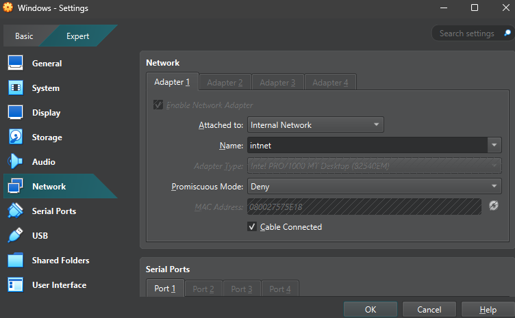

# Home Lab

## Objective

The Home Lab project allows the user to set up a controlled environment to simulate real-world scenarios to further understanding within the field of cybersecurity. It provides a foundation for hands-on-learning and experimentation within the field. Future projects will reference this as a setup for labs.

---

### Skills Learned

- Setting up and configuring virtualization platforms.
- Designing segmented networks for secure communication.
- Deploying and integrating key cybersecurity tools.
- Basic automation techniques for efficient setup and scaling.

---

### Tools Used

- **Virtualization:** VirtualBox (or alternatives like VMware Workstation).
- **Networking:** Virtual network adapters and custom routing configurations.
- **Operating Systems:** 
  - Kali Linux (attacker/analysis machine).
  - Windows Server/Client (target/victim).
- **Infrastructure Requirements:** 
  - A host machine with at least 16 GB of RAM, quad-core CPU, and ~50 GB free storage.
 
---

## Steps to Set Up the Home Lab

### **1. VirtualBox Installation**
- Install VirtualBox on your host machine.
- Download it from [VirtualBox Official Site](https://www.virtualbox.org/).

*Ref 1: VirtualBox installer on a Windows machine.*


---

### **2. Virtual Machine Creation**

#### **Step 2.1: Using the Kali Linux VirtualBox Installer**
1. Download the **Kali Linux VirtualBox Image** from the [Kali Linux Official Downloads](https://www.kali.org/get-kali/#kali-virtual-machines).
   - Choose the version for **VirtualBox**.
   - Ensure you download the image matching your system's architecture (e.g., 64-bit).
2. Extract the downloaded `.7z` file:
   - Use **7-Zip** (recommended). Download it from [7-Zip Official Website](https://www.7-zip.org/).
   - On Windows, install **7-Zip** and right-click the `.7z` file, then select `7-Zip > Extract Here`.
   - On Linux/macOS, use the default archive manager or install `p7zip`:
     ```bash
     sudo apt install p7zip-full -y  # For Linux
     ```
3. Set up the virtual machine:
   - Locate the extracted VirtualBox Machine Definition file.
   - Simply double-click the VirtualBox Machine Definition file, and VirtualBox will automatically set up the VM.

---

#### **Step 2.2: Adjust Kali Linux VM Settings**
1. Once the Kali Linux VM is created, select it in VirtualBox and click **Settings**.
2. Modify the following settings:
   - **System > Motherboard**:
     - Allocate at least **2 GB of RAM** (2048 MB).
   - **System > Processor**:
     - Assign at least **2 CPUs**.
   - **Display > Screen**:
     - Set **Video Memory** to **128 MB**.
     - Enable **3D Acceleration** (optional but recommended).
   - **Network > Adapter 1**:
     - Set to **Internal Network** and name it (e.g., `intnet`).

---

#### **Step 2.3: Creating the Windows VM**
1. Download the Windows ISO from the [Microsoft Evaluation Center](https://www.microsoft.com/en-us/evalcenter/).
2. Repeat the same process as Kali, allocating at least **4 GB of RAM** and **30 GB of disk space**.
3. Install Windows and set up a user account.

*Ref 2: RAM and CPU settings on VirtualBox.*


*Ref 3: Storage Settings on VirtualBox.*


---

### **3. Networking Configuration**
#### **Step 3.1: Private Network Setup**
1. In VirtualBox, configure the network adapters for both VMs:
   - Adapter Type: **Internal Network**.
   - Network Name: `intnet` (or any custom name).
2. Assign static IP addresses to the VMs:
   - **Kali Linux**:
     *Note: To log into Kali, the default username is **kali** and the default password is also **kali***
     ```bash
     sudo nano /etc/network/interfaces
     ```
     Add the following configuration:
     ```bash
     auto eth0
     iface eth0 inet static
     address 192.168.56.101
     netmask 255.255.255.0
     gateway 192.168.56.1
     ```
   - **Windows**: 
     Configure the IP manually in the Network Settings as `192.168.56.102`.

*Ref 4: Network Adapter Settings in VirtualBox.*



**Here is a diagram of the current network configuration**

*Ref 5: Network Configuration Diagram.*


---

### **4. Test the Connection**
1. Start both VMs.
2. From Kali Linux, ping the Windows VM:
   ```bash
   ping 192.168.56.102
   ```
   - *If Windows Firewall blocks communication, stop the ping test using Ctrl+C*
3. From Windows, test the connection to Kali Linux:
   - Open Command Prompt (`cmd`) and run:
     ```bash
     ping 192.168.56.101
     ```
4. Ensure both VMs can ping each other successfully.

*Ref 6: Successful ping results from Windows to Kali Linux*


---

### **5. Related Projects**
Here are some of my projects that use this home lab:
- [Network Analysis Project](https://github.com/TuragIk/network-analysis-project)
---

### **6. Connecting Kali to the internet**
Many of the tools that you may need with Kali require internet connection. This is not possible with the current configuration with an internal network.

**Set up temporary internet connection:**
1. In VirtualBox, open the settings for the Kali Linux VM.
2. In Network, under Adapter 1, change *Attached to:* to **NAT**.
   
*Ref 7: Changing Adapter settings to NAT*


3. Click OK and open the Kali VM.
4. It is likely that Kali will not boot correctly. To fix this, type
   ```bash
   blkid
   ```
   in the terminal. Make note of the paths of the resulting lines.
5. For each resulting line, type
   ```bash
   fsck (INSERT PATH HERE) -y
   ```
6. After running `fsck` for each outputted line, type reboot -f

*Ref 8: initramfs Error Example*

  

7. Log into Kali and install any necessary tools for your project.
8. Close the VM, and go back to VirtualBox and set the KaliVM network adaptor back to **Internal Network**, with the appropriate name of your network.

*Ref 9: Changing Adapter settings to Internal Network*

  

---

### **Conclusion**
Congratulations on setting up a home lab! Future projects will reference this lab as a setup, and feel free to check out Related Projects for some exemplar labs to use!

### **License**
This project is licensed under the MIT License. See the `LICENSE` file for details.
